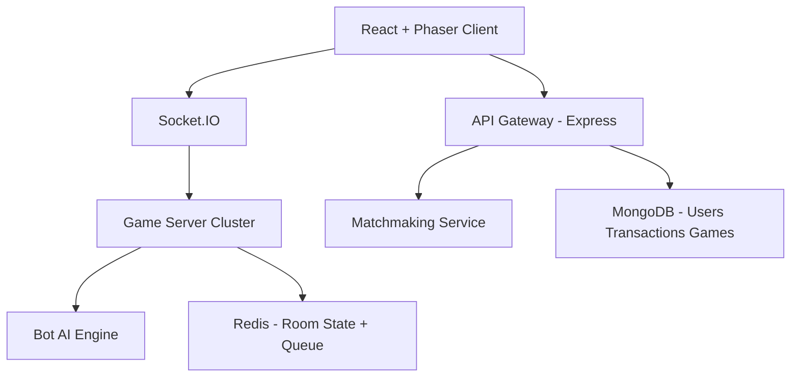

# Production-Grade Multiplayer Ludo Platform

This repository implements a modular multiplayer Ludo platform with server-authoritative gameplay, Redis-backed realtime state, Socket.IO events, wallet workflows, bot AI, and admin controls.

## Tech Stack
- Frontend game engine: Phaser.js
- Frontend UI: React + Vite
- Backend: Node.js + Express
- Realtime: Socket.IO
- Database: MongoDB
- Cache/state/queue: Redis
- Deployment: Docker + Nginx load balancer

## Architecture


## Project Structure
- `backend/`
- `backend/controllers`
- `backend/routes`
- `backend/models`
- `backend/services`
- `backend/sockets`
- `backend/game-engine`
- `backend/bot-engine`
- `backend/matchmaking`
- `backend/wallet`
- `frontend/`
- `frontend/phaser-game`
- `frontend/react-ui`
- `frontend/components`
- `deploy/`

## Core Features
- Realtime multiplayer Ludo rooms with isolated room state in Redis
- Redis queue based matchmaking with 8s wait, bot fallback
- Full server-authoritative move validation:
  - `rollDice()`
  - `getPossibleMoves()`
  - `validateMove()`
  - `moveToken()`
  - `checkKill()`
  - `checkWinner()`
- AI bot engine:
  - Heuristic board scoring
  - Monte Carlo rollout simulation
  - Easy/Medium/Hard profiles
  - Human-like delays and styles
- Wallet system:
  - Deposit request (UTR)
  - Withdrawal request (UPI ID)
  - Admin approval workflow
  - Entry fee deduction + prize credit
- Admin APIs:
  - Approve/reject transactions
  - View users, games
  - Ban users
  - Adjust wallet balance
- Security:
  - Server-authoritative rules
  - Rate limiting
  - Anti-cheat event velocity tracking
  - Never trust client state

## Matchmaking Logic
1. User emits `joinQueue` with `entryFee`
2. User is pushed to Redis queue `mm:queue:{entryFee}`
3. Service waits up to 8 seconds
4. If matching human found: create room with 2 humans
5. Else: assign bot and start room

## Socket.IO Events
- Incoming: `joinQueue`, `rollDice`, `moveToken`
- Outgoing: `matchFound`, `startGame`, `diceResult`, `boardUpdate`, `turnChange`, `gameEnd`

## Game State Shape
```json
{
  "roomId": "string",
  "players": [
    { "id": "u1", "type": "human" },
    { "id": "bot-123", "type": "bot" }
  ],
  "turn": "u1",
  "diceValue": 6,
  "tokens": {
    "u1": [0, 0, 0, 0],
    "bot-123": [0, 0, 0, 0]
  },
  "winner": null,
  "createdAt": "ISO"
}
```

## Local Run
1. Backend:
   - `cd backend`
   - `cp .env.example .env` (or create manually on Windows)
   - `npm install`
   - `npm run dev`
2. Frontend:
   - `cd frontend`
   - `npm install`
   - `npm run dev`

## Docker Deployment
- Compose file: `deploy/docker-compose.yml`
- Nginx LB: `deploy/nginx.conf` (sticky sessions via `ip_hash`)

Run:
- `cd deploy`
- `docker compose up --build`

## Scale Strategy for 10k+ Concurrency
- Stateless game servers with horizontal replicas
- Redis for room state + queue
- Nginx sticky sessions for WebSockets
- Separate matchmaking, game loop, bot workers (can be split into dedicated services)
- Mongo for durable history and wallet ledger

## Important Production Notes
- Replace header-based auth with JWT/OAuth
- Integrate real payment gateway for UPI verification and payout webhooks
- Add idempotency keys for wallet actions
- Add distributed lock around queue pop for strict pairing under heavy load
- Add observability: Prometheus + Grafana + centralized logs
- Add integration and load tests before production launch